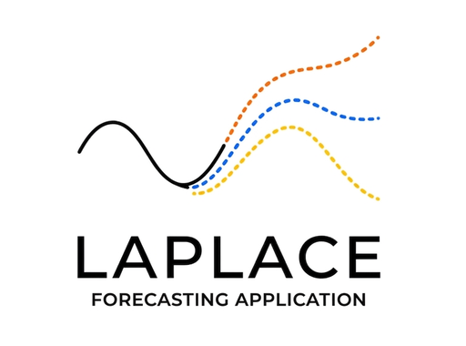

<div align="center">
  
  <h1>Laplace V2</h1>
  <p><b>Foundation Model Forecasting for the Boardroom</b></p>
</div>

---

**Laplace** is a desktop-first, full-stack application designed to answer a single question with absolute rigor: *What is the most accurate way to predict the future of this time series?*

Named after [Laplace's Demon](https://en.wikipedia.org/wiki/Laplace%27s_demon), this app bridges the gap between hardcore data science labs and executive boardrooms. It pits zero-shot Foundation Models (**Google TimesFM, Amazon Chronos**) against battle-tested statistical baselines (**ETS, Theta, Seasonal Naive**) in a rigorous, zero-leakage backtest—all wrapped in a vibrant, minimalist, zero-friction UI.

## 🧠 Why Laplace?

Most forecasting tools are either too simple (ignoring confidence intervals and signal validation) or too complex (requiring 50 lines of Python just to see a trend). Laplace is built differently:

- **Smart Heuristics & Real-World Scenarios:** Drop a CSV or select from our hardcore benchmark suite (S&P 500, VIX, Walmart M5 Demand, National Grid). Laplace auto-detects temporal indices and targets.
- **The Principal Data Analyst Lab (EDA):** Decompose the signal (STL), calculate Autocorrelation (ACF/PACF), compute heavy-tailed statistics (Skewness, Kurtosis), and identify Trend Changepoints (Ruptures). Seamlessly toggle between **Boardroom Didactics** (business-friendly, value-driven copy) and **Lab Didactics** (uncompromising, hardcore mathematical explanations) across all diagnostic views.
- **Interactive Data Prep & Auto-Inversion:** Handle missing values via linear interpolation, dynamically exclude Isolation Forest anomalies (interactive checkbox outliers), and apply variance-stabilizing transformations (Log, Box-Cox). Preprocessing states are automatically propagated to validation and forecasting backends where they are mathematically inverted—ensuring error metrics (sMAPE, MAE) and charts are rendered strictly in the original target scale.
- **Active Exogenous Covariate Impact Analyzer:** Analyze predictive strength using Pearson correlation coefficients ($r$) mapped on high-contrast dual-sided sliders. Identify weak drivers ($|r| < 0.2$) with built-in noise alerts, and dynamically include or exclude features from covariate-capable models (e.g., Chronos-2) with active toggle controls.
- **Foundation Models vs. The Classics:** Automatically backtest zero-shot Deep Learning architectures (`google/timesfm-1.0-200m`, `amazon/chronos-bolt-base`, `amazon/chronos-t5` vs. classical baselines like `AutoETS` and `AutoTheta`) using a rolling-origin validation engine. PyTorch automatically leverages Apple MPS/CUDA acceleration if available.
- **Export Studio:** The winning architecture projects future quantiles (80% Confidence Intervals) ready for executive reviews. Customize CSV exports, include/exclude history, and copy a fully reproducible Pandas snippet to recreate the visualization inside Jupyter notebooks.

## 🏗 Architecture

Laplace is built on a modern, decoupled stack prioritizing speed and visual excellence:

### Engine (Backend)
- **FastAPI** — High-performance async API.
- **uv** — Lightning-fast Python package and environment manager.
- **StatsForecast** (`Nixtla`) — Blazing fast C++ implementations of classical baselines.
- **TimesFM & Chronos** (`Google/Amazon`) — Deep learning zero-shot forecasting via PyTorch/HuggingFace.
- **Scikit-Learn & Ruptures** — State-of-the-art anomaly and changepoint detection.

### Interface (Frontend)
- **React 18 + Vite** — Snappy SPA navigation.
- **Tailwind CSS** — Custom *Vibrant Minimalist* design system (High contrast, electric accents).
- **Recharts** — Performant, customized D3-based SVG charts.
- **Lucide** — Clean, modern iconography.

## 🚀 Getting Started

### Prerequisites
- Node.js (v18+)
- Python (v3.10+)
- [uv](https://github.com/astral-sh/uv) installed (`curl -LsSf https://astral.sh/uv/install.sh | sh`)

### Quick Start
To launch the entire platform (Backend + Frontend) cleanly in a single terminal:

```bash
# In the root of the project
./start.sh
```

The script will automatically:
1. Kill any stale background processes (uvicorn/vite)
2. Boot the FastAPI engine
3. Boot the React interface
4. Listen for `Ctrl+C` to gracefully shutdown both

The app will be available at `http://localhost:5173`.

## 🧪 The Workflow

1. **Input:** Select a rigorous benchmark (Economics, Demand, Supply) or upload your own chaotic dataset.
2. **Diagnostics & EDA:** Clean missing values, prune Isolation Forest anomalies, and apply variance-stabilizing transforms (Log, Box-Cox). Switch between Boardroom/Lab copies to align your strategy, and filter out low-correlation exogenous drivers using the Covariate Impact Analyzer.
3. **Validation:** Laplace splits your data, applies your selected preprocessing configuration, backtests Google and Amazon models alongside classical baselines, automatically applies inverse-variance mathematics, and ranks them on the leaderboard by sMAPE.
4. **Forecast & Export Studio:** The winning model generates the final future forecast. Laplace automatically inverts all transforms to show original-scale data, allows high-fidelity visual exploration, and provides courtroom-grade reproducible Pandas snippets and boardroom-ready CSVs.

## 📜 License
MIT License. Built for forecasting enthusiasts.
